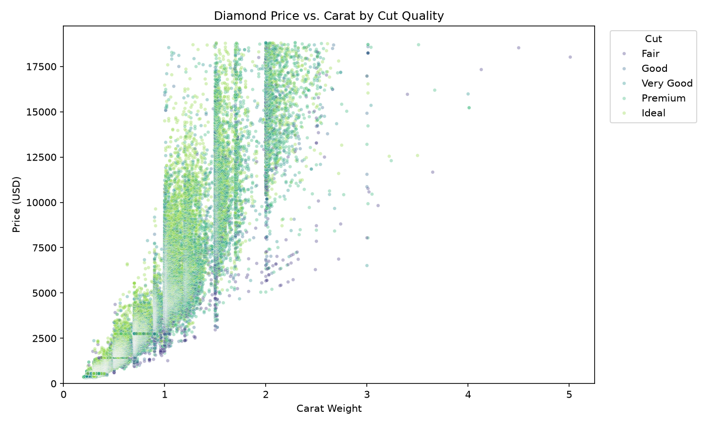
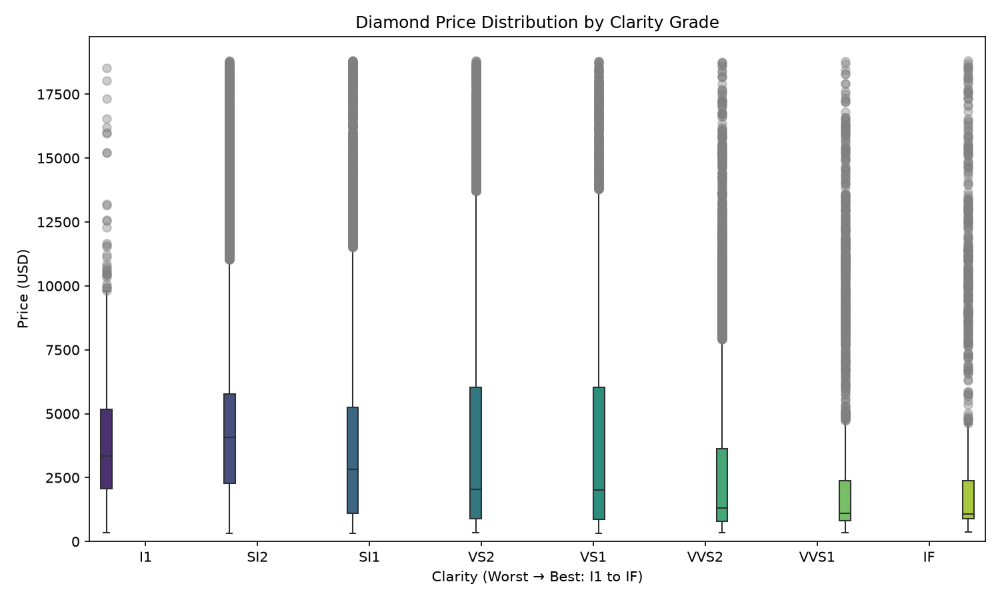

# Can the Price of a Diamond Be Determined Based Upon Its Features?

The main research question of this project is whether the price of a diamond can be predicted based on its carat weight, cut, color, and clarity.

## Dataset and Data Cleaning

**Source:** [Kaggle Diamonds Dataset](https://www.kaggle.com/datasets/shivam2503/diamonds)

The dataset contains 53,940 diamonds with a variety of features that can be used to investigate the research question.

The data was cleaned as follows:

- Dropped a leftover index column from the CSV export.
- Removed 23 rows with impossible dimensions in the `x`, `y`, and `z` values.
- Set `cut`, `color`, and `clarity` as ordered categorical variables so plots follow the appropriate grading order rather than alphabetical order.

## Exploratory Data Analysis

The main research question is broken into three sub-questions.

### Sub-question 1: How strongly is carat weight related to diamond price?



The scatter plot shows a strong positive relationship between carat weight and price. Price increases nonlinearly as carat weight increases, with noticeable clustering around 1.0, 1.5, and 2.0 carats.

The different cut categories are distributed throughout the price range, suggesting that cut quality alone does not explain the large differences in diamond prices.

**Finding:** Carat weight appears to be the strongest visible driver of diamond price.

### Sub-question 2: How does clarity relate to diamond price?



The boxplot shows that price distributions vary across clarity grades. However, clarity by itself does not determine price.

One important reason is that carat weight is related to both price and the characteristics of the diamonds within each clarity group. Larger diamonds can have lower clarity grades while still commanding high prices because of their size.

**Finding:** Clarity contributes to price, but it should be considered together with carat weight rather than used as an independent predictor.

### Sub-question 3: Does the carat-price relationship remain consistent across color grades?

[Interactive Visualization](assets/carat_price_interactive.html)

The interactive visualization allows the relationship between carat weight and price to be viewed across the color grades from J to D.

Moving through the color grades shows that the nonlinear relationship between carat weight and price remains visible across the different color categories.

**Finding:** Carat weight remains an important price driver across color grades, although color and the other diamond characteristics also contribute to the final price.

## Conclusion

Diamond price can reasonably be estimated from its features, but no single feature is sufficient to determine price by itself.

Carat weight is the strongest visible driver of price in this exploratory analysis. However, cut, color, and clarity also contribute to the overall price and should be considered together.

The visualizations demonstrate relationships between these variables, but they do not prove that one feature directly causes changes in price.

## Project Structure

```text
Module10/
├── assets/
│   ├── carat_vs_price_by_cut_quality.png
│   ├── price_by_clarity.png
│   └── carat_price_interactive.html
├── data/
│   └── diamonds.csv
├── dashboard.py
├── visualization.py
├── requirements.txt
└── README.md